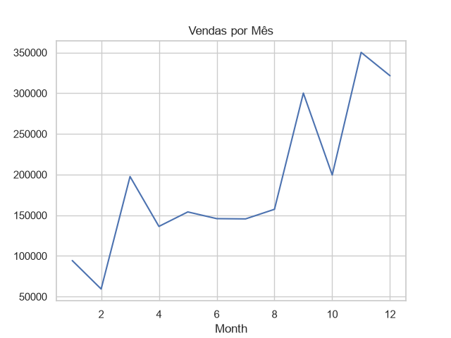

# 📊 Análise de Dados de Vendas com Python

## 📌 Visão Geral do Projeto
Este projeto realiza uma análise exploratória de dados (EDA) em um conjunto de dados de vendas no varejo, com o objetivo de gerar insights de negócio, identificar padrões e oportunidades de melhoria.

## 🎯 Objetivos
- Identificar os produtos mais vendidos
- Analisar a receita por região
- Detectar tendências de vendas ao longo do tempo
- Encontrar oportunidades de crescimento no negócio

## 🛠️ Ferramentas e Tecnologias
- Python
- Pandas
- Matplotlib
- Seaborn

## 📈 Principais Insights
- A região West gera a maior parte da receita, indicando forte desempenho comercial
- Um único produto domina o faturamento total, sugerindo alta concentração em itens de maior valor
- As vendas atingem pico nos meses de novembro e dezembro, evidenciando sazonalidade
- A região South apresenta baixo desempenho, indicando oportunidade de crescimento

## 📊 Visualização de Exemplo


## 🚀 Como Executar o Projeto
1. Clone o repositório
2. Instale as dependências:
```bash
pip install -r requirements.txt
